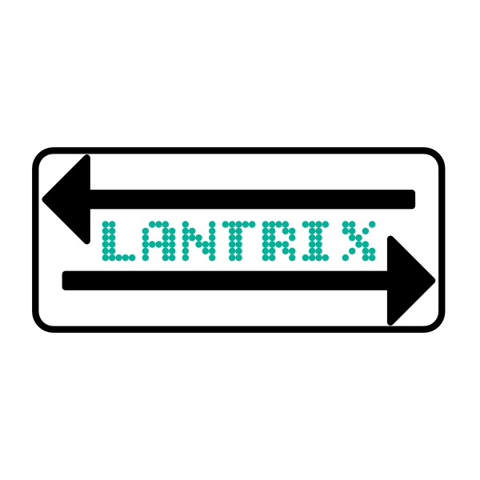

<div align="center">



# LANTRIX

**A tiny static file server — with optional HTTPS, directory listing, index files, and Basic Auth.**

</div>

---

## Features

- Serve the current directory (or a chosen folder)
- Directory listing + subdirectories
- Serves `index.html` / `index.htm` automatically when present
- Optional HTTP Basic Auth
- Optional HTTPS with a self-signed cert generated on startup
- `--print-cert` to output the generated certificate (handy for trusting it locally)

---

## Install

### Build from source

```bash
git clone <your-repo-url>
cd lantrix
cargo build --release
